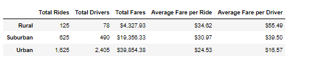
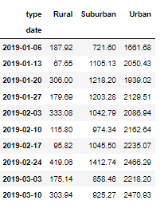
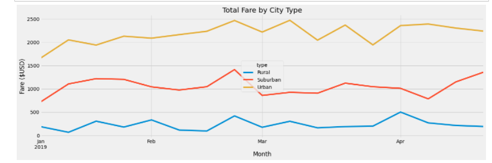

# PyBer_Challenge

## Overview & Purpose
This project has been undertaken to create visualizations of rideshare data for the company PyBer in order to help improve access to ride sharing services and help the management determine affordability for underserved neighbourhoods. A summary dataframe of the ride sharing data by city type has been created using Python from the CSV files available at Pyber and then a multiple line graph has been created using the Matplotlib library to show the total weekly fares for ach city type.The data has been analyzed on the basis of three city types-
- Urban
- Suburban
- Rural

## Results

### Summary DataFrame

- The total number of rides in the urban cities are 13 times higher than that of rural cities and 2.6 times higher compared to suburban cities.
- The total number of drivers are almost 31 times higher than that of rural cities and 4.9 times higher compared to suburban cities.
- Urban cities generate the highest revenue ($39,854.38), which is twice the revenue generated by suburban cities ($19,356.33) and 9.2 times the revenue generated by rural cities.
- The average fare per ride is highest in rural cities($34.62) followed by suburban cities ($30.97). The average fare per ride in urban cities ($24.53) is almost 1.4 times lower than rural cities and almost 1.2 times lower than the suburban cities.
- Since the average fare per ride is higher in rural cities compared to the other city types and the number of drivers are much lesser, the average fare per driver is also the highest ($55.49) in rural cities compared to suburban cities ($39.50) and rural cities ($16.57) where the number of drivers are the highest and the average fare per ride is the lowest.

### Total Fare by City Type

From the merged summary dataframe, we created a pivot table based on date, city type and fares to calculate the total fares for each city type by date and subsequently converted the same to fare per week for each city type. For below analysis, we have considered the fare per week for different city types between January 01,2019 and April 29,2019.

Then we have plotted the data on the same dataframe into a multiple line graph to clearly visualize the ride sharing trends from January to April.

From the line chart, we can notice that-
- The total fares increase in late February for all three city types.
- For urban cities, the total fares reaches its peak to around $2500 in around third week of February and beginning of March and it continues to drop and rise throughout March before settling around $2400 in the beginning of April.
- The total fares for the suburban cities reaches its peak of around $1500 in late February and continues to hover around $1000 till end of March followed by a slight dip in the beginning of April and rising again.
- The total fares for the rural cities are highest at around third week of February and last week of March before dropping again in April.

### Conclusion
- Urban Cities generate the highest revenue.
- The average fare per ride is the highest in the rural cities and is lowest in the urban cities.
- The urban cities  more drivers than the number of rides and also the lowest average fare and therefore the lowest average fare per driver.
- The rural cities  have more rides than the number of drivers with the highest average fare per ride and therefore the highest average fare per driver.
- The total fares increase around third week of February for all all city types.
- Additionally, the first and third week of March are lucrative for urban cities, middle of April is lucrative for suburban cities and last week of March is lucrative for rural cities.

## Summary & Recommendations

1. Urban cities have the highest demand for ridesharing services and also generates the highest revenues. Since there are more drivers than the rides, Pyber should consider investing in advertising in urban cities to increase the number of rides. This will not only help the drivers earn more whose average fares are the lowest, but will also lead to increase in revenue.
2. The rural cities seem underserved as there are more rides than the total number of drivers. Since the average fare per ride is the highest in rural cities, Pyber might benefit if they can increase the number of drivers to increase the total number of rides. However further market research is required first to understand if there is potential for increase in demand in rural cities.
3. Pyber should offer additional discounts or other incentives in the suburban cities in January and March to increase the demand so that it can lead to higher revenues.
